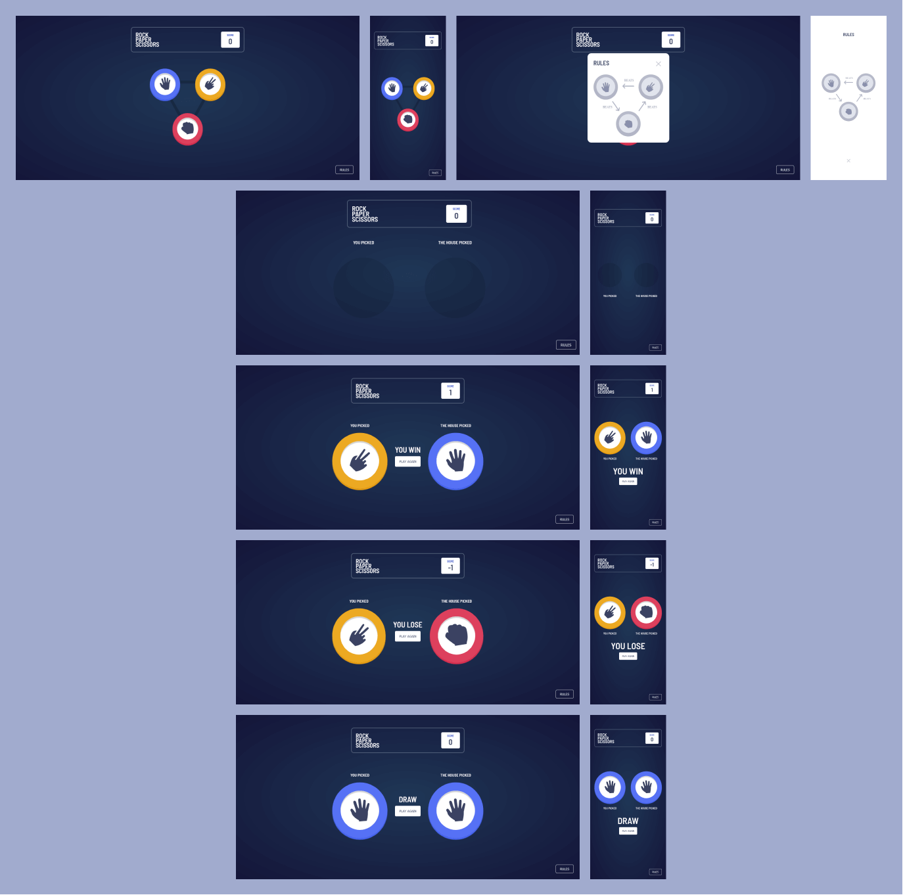

# Rock, Paper, Scissors Game

Rock, Paper, Scissors is a very popular game. So, inspired by one of the challenges of the [Frontend Mentor](https://www.frontendmentor.io/challenges/rock-paper-scissors-game-pTgwgvgH) website, I created this game in order to learn more about Typescript and React.

## Table of contents

- [Overview](#overview)
  - [The challenge](#the-challenge)
  - [Screenshot](#screenshot)
  - [Link](#link)
- [My process](#my-process)
  - [Built with](#built-with)
  - [What I learned](#what-i-learned)
- [Author](#author)

## Overview

### The challenge

Users should be able to:

- View the optimal layout for the game depending on their device's screen size
- Play Rock, Paper, Scissors against the computer

### Screenshot

### Link

[Demo](https://rock-paper-scissors-game-keven.netlify.app/)

## My process

### Built with

- Semantic HTML5 markup
- CSS custom properties
- Flexbox
- CSS Grid
- Mobile-first workflow
- [Typescript](https://www.typescriptlang.org/)
- [React](https://reactjs.org/) - JS library
  - Hooks
  - Context API
- [Sass](https://sass-lang.com/) - For styles
- [Webpack 5](https://webpack.js.org/)
- [Bebel](https://babeljs.io/)

### What I learned

I trained React JS context API and Hooks concepts, use of variables in Sass and typing concepts with Typescript. In addition to configuring webpack 5 together with Babel.

## Author

- [LinkedIn](https://www.linkedin.com/in/kevenpacheco/)
